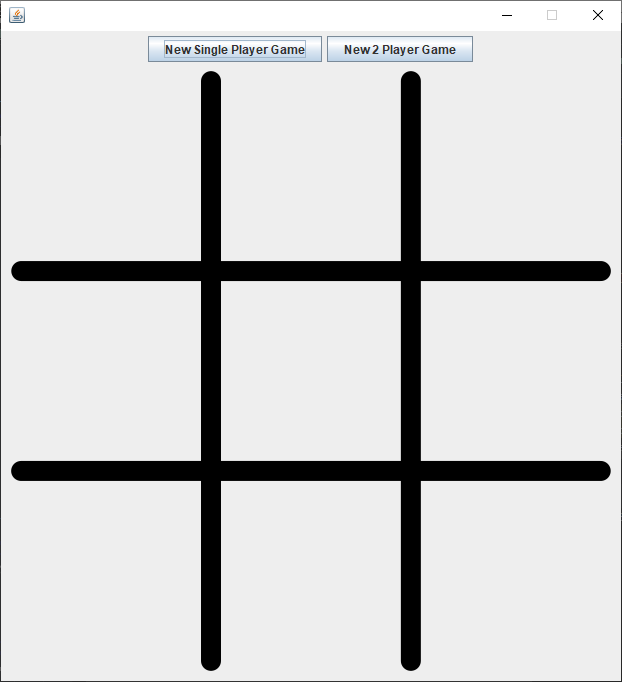
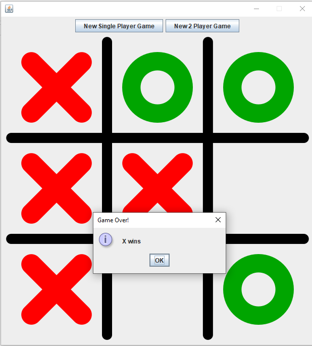
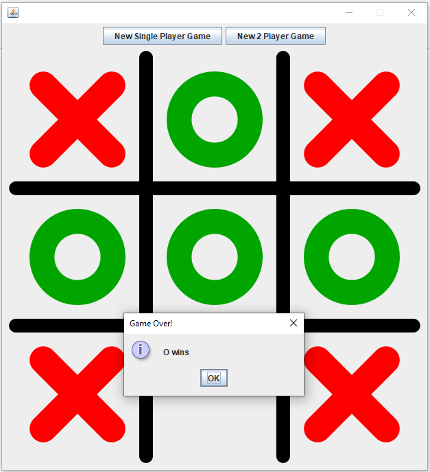
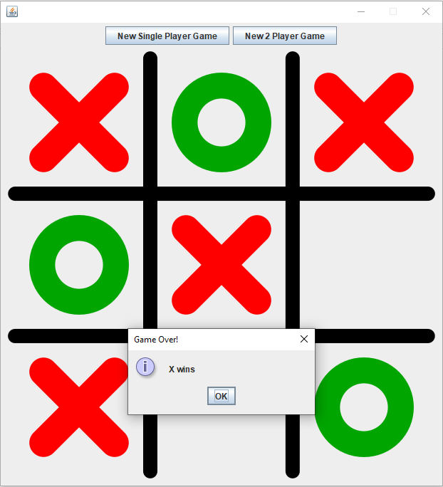
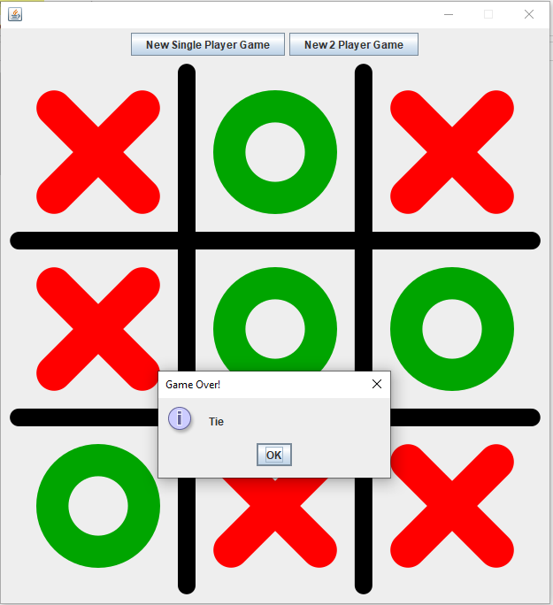

# TicTacToe

 Capstone project (done independently) for <i> <a href = "https://in.udacity.com/course/java-programming-basics--ud282" title = "Udacity's Java basics"> Udacity's Java Programming Basics </a> </i> course.

Project Summary
---------------
In this project, we were required to complete the code for a Tic-Tac-Toe game. The source code of the game GUI and logic was provided <a href = "https://github.com/udacity/ud282" title = "GitHub project code for Java"> here</a>. The code needed to be completed to test all the rows, columns and diagonals for a winner and announcing a winner or a tie.  
The <i> checkGameWinner() </i> function in <i> Game.java </i> is implemented to detect the game winner.

Screenshots
-----------

## License

The content of this repository is licensed under a
[GNU General Public License v3.0](LICENSE).
